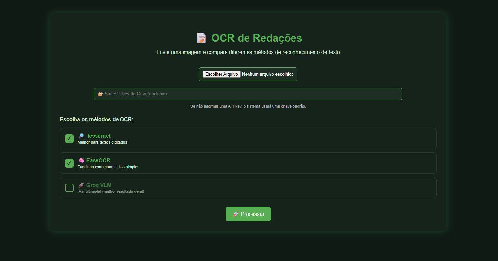
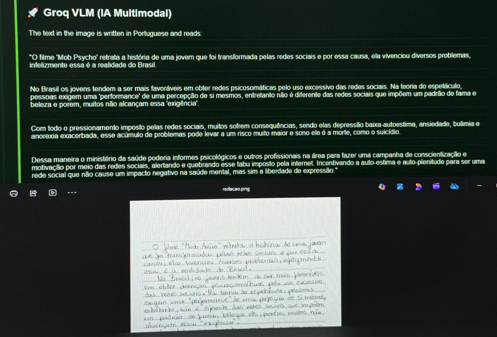

# 🧠 OCR de Redações com IA Multimodal

Sistema híbrido de OCR desenvolvido para reconhecimento e processamento de redações digitadas e manuscritas utilizando OCR tradicional e Inteligência Artificial multimodal.

O projeto foi desenvolvido como pesquisa acadêmica no curso de Análise e Desenvolvimento de Sistemas do IFSP – Câmpus Jacareí.

---

# 🚀 Funcionalidades

✅ Upload de imagens de redações  
✅ OCR tradicional com Tesseract  
✅ OCR com EasyOCR  
✅ OCR multimodal com IA (Groq VLM)  
✅ Comparação entre diferentes métodos  
✅ Organização automática do texto em linhas  
✅ Correção manual pós-processamento  
✅ Salvamento de textos corrigidos  
✅ Interface web interativa em Flask  
✅ Sistema de loading/progresso visual  

---

# 📸 Interface do Sistema

## Tela principal


```md

```

## Comparação entre OCRs


```md

```

---

# 🧠 Tecnologias Utilizadas

| Tecnologia | Finalidade |
|---|---|
| Python | Linguagem principal |
| Flask | Interface web |
| Tesseract OCR | OCR tradicional |
| EasyOCR | OCR baseado em Deep Learning |
| OpenCV | Pré-processamento de imagens |
| GroqCloud | IA multimodal |
| OpenAI SDK | Comunicação com API |
| Pillow | Manipulação de imagens |
| Torch | Backend do EasyOCR |

---

# 📊 Comparação de Desempenho

| Ferramenta | Tipo de Texto | Precisão Média | Observações |
|---|---|---|---|
| Tesseract | Digitado | ~99% | Excelente para textos limpos |
| Tesseract | Manuscrito | <10% | Baixo desempenho |
| EasyOCR | Manuscrito | ~45% | Identifica palavras, mas perde contexto |
| TrOCR | Manuscrito | Variável | Melhor em pequenos trechos |
| Groq VLM | Digitado | ~98% | Muito consistente |
| Groq VLM | Manuscrito | ~85–90% | Melhor resultado geral |

---

# ⚙️ Instalação

## 1️⃣ Clone o projeto

```bash
git clone https://github.com/tuh-oliveira/ocr-redacoes-ia.git
cd ocr-redacoes-ia
```

---

## 2️⃣ Crie um ambiente virtual

### Python 3.10 (recomendado)

```bash
py -3.10 -m venv venv
```

### Ative o ambiente virtual

```powershell
.\venv\Scripts\Activate.ps1
```

---

## 3️⃣ Instale as dependências

```bash
pip install -r requirements.txt
```

---

## 4️⃣ Instale o Tesseract OCR

Baixe:

👉 https://github.com/UB-Mannheim/tesseract/wiki

Adicione ao PATH do Windows:

```txt
C:\Program Files\Tesseract-OCR\
```

---

## 5️⃣ Configure a API da Groq

Crie um arquivo `.env` na raiz do projeto:

```env
GROQ_API_KEY=sua_chave_aqui
```

Obtenha sua chave em:

👉 https://console.groq.com/

---

# ▶️ Como Executar

```bash
python app.py
```

Abra no navegador:

```txt
http://127.0.0.1:5000
```

---

# 🧪 Funcionamento do Sistema

O pipeline do sistema funciona em etapas:

1. 📷 Upload da imagem
2. 🧹 Pré-processamento
3. 📍 Detecção de texto
4. 🧩 Agrupamento em linhas
5. 🔤 OCR tradicional
6. 🤖 OCR multimodal com IA
7. 📊 Comparação dos resultados
8. ✍️ Correção manual opcional
9. 💾 Salvamento da versão corrigida

---

# ⚠️ Limitações

Apesar dos avanços obtidos, o reconhecimento de textos manuscritos ainda apresenta limitações importantes:

- Caligrafias complexas reduzem a precisão
- Iluminação e qualidade da imagem impactam o OCR
- APIs multimodais podem apresentar instabilidade
- Modelos gratuitos possuem limitações e mudanças frequentes
- OCR manuscrito ainda é um problema aberto na computação

---

# 🔮 Melhorias Futuras

- Fine-tuning com redações brasileiras
- Avaliação automática estilo ENEM
- Treinamento de modelo próprio
- Melhor segmentação de linhas
- Histórico de correções
- Exportação em PDF/TXT
- Dashboard estatístico
- Comparação automática de similaridade

---

# 📚 Contexto Acadêmico

Este projeto foi desenvolvido como parte de estudos sobre:

- OCR (Optical Character Recognition)
- Visão Computacional
- Inteligência Artificial
- Modelos Multimodais
- Processamento de Imagens
- Deep Learning aplicado à linguagem

---

# 👨‍💻 Autor

### Arthur Araújo de Oliveira

📍 IFSP – Câmpus Jacareí  
🎓 Análise e Desenvolvimento de Sistemas  

---

# 📄 Licença

Projeto desenvolvido para fins acadêmicos e educacionais.